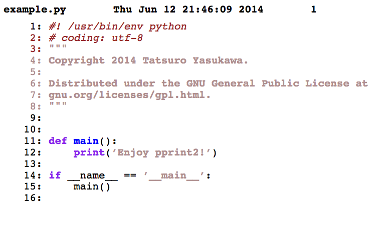

pprint2
---------

Print out source code beautifully.
pprint2 is desgined mainly for Mac OSX
but can be used another OS like linux easily.

Installtion
-----------
```
git clone https://github.com/SamuraiT/pprint2
```
After installtion go to `pprint2` directory.

```
cd pprint2
```
Afterwards, install dependency and set `pprint2` command
```
#in pprint2/ directory
source install.sh
```

Usage
-------
Enter this command in terminal(use bash shell)
```
pprint2 filename
```
After this command, pdf file will be created.


Requirements
------------

* `brew`
* `bash shell`

Example
-------
```
pprint2 example.py
```
After this command, you will get a `example.py.pdf` file like this:



